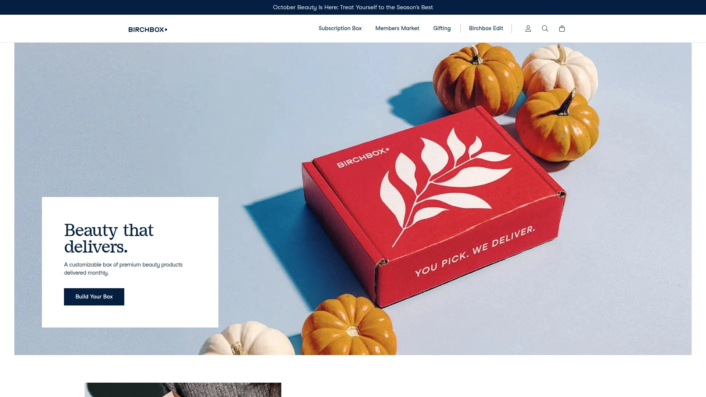
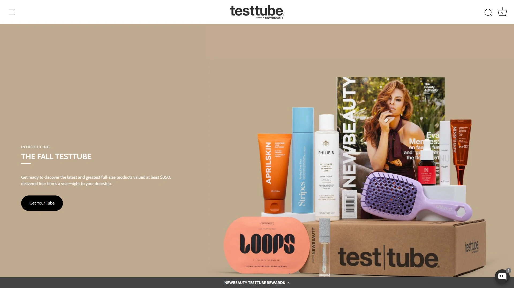
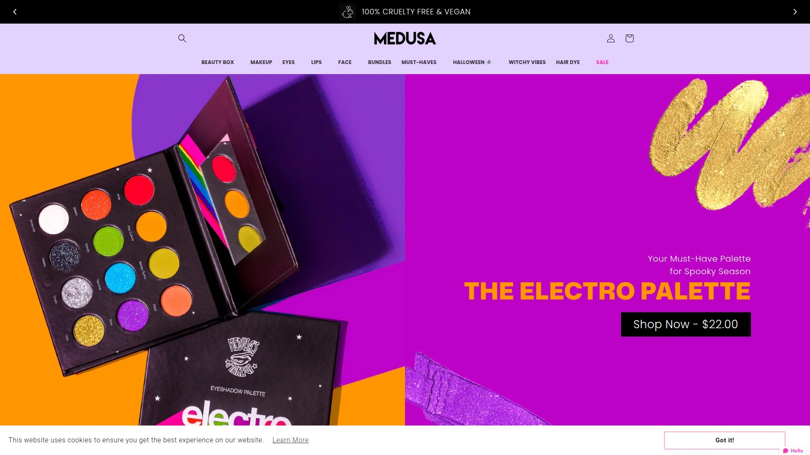

# Top 18 Beauty Subscription Box Services in 2025 (Latest Updated)

When makeup lovers want personalized beauty discoveries without the department store price tags, monthly subscription boxes solve the "what's next" dilemma while keeping routines fresh and wallets happy. These curated services bring deluxe samples and full-size products straight to your door, letting you test new brands before committing to full bottles—and often at a fraction of retail cost. From beginner-friendly sample sizes to premium quarterly splurges, today's beauty boxes cater to every preference, skin type, and budget, making it easier than ever to find products that actually work for you.

## **[IPSY](https://www.ipsy.com)**

The personalized beauty pioneer that started it all—customizable bags, massive brand selection, and unbeatable value for discovering your next favorites.

IPSY offers three distinct subscription tiers to match different beauty needs. The Glam Bag delivers five deluxe samples monthly for $14, including one product you personally choose from a curated selection. BoxyCharm by IPSY provides five full-size products worth up to $200 for $32 monthly, letting you pick three items yourself. The Icon Box arrives quarterly at $60, featuring eight full-size products valued at $350, with three customizable selections curated by beauty celebrities and tastemakers.

The personalization happens through a Beauty Quiz capturing your skin tone, hair color, favorite brands, and product preferences. IPSY's algorithm uses millions of member ratings to improve matches each month. Members also access the IPSY Shop with products discounted 30-80% off retail, plus quarterly Mega Drop Shop sales. Each subscription includes collectible makeup bags, though these accumulate over time. The service ships to the US, Canada, and Mexico, with different tier availability by region.

## **[Birchbox](https://www.birchbox.com)**

The original beauty box subscription that pioneered the discovery model—now fully customizable with samples, travel sizes, and full-size options you personally select.

Birchbox takes a choose-your-own approach rather than surprise-only curation. Subscribers pick all products from three categories during customization windows, selecting one full-size item, two deluxe samples, and three smaller samples for $25 monthly. The process starts with a beauty profile questionnaire about skin type, hair needs, and style preferences, then Birchbox presents options tailored to those answers. Products span makeup, skincare, haircare, and fragrance from brands like MAC, Sunday Riley, Kiehl's, and Ouai.

The customization flexibility means boxes vary significantly between subscribers—everyone receives different items based on personal selections. Birchbox also offers an online shop where members can purchase full-size versions of sampled products, plus exclusive member discounts. The service occasionally runs promotional offers, including discounted first boxes for new subscribers. Shipping is free in the US, with monthly billing after the initial signup charge.

## **[GlossyBox](https://www.glossybox.co.uk)**

Themed monthly boxes featuring five trending products worth over £50, delivered for as little as £12.50 with flexible subscription plans and priority access to limited editions.

GlossyBox curates themed collections each month rather than offering product customization. Boxes contain five makeup, haircare, and skincare items from established and emerging brands. The UK version costs £13.50 monthly (or £12.50 with annual prepayment), while US boxes run slightly higher. Themes change seasonally and might focus on color palettes, specific activities like date night, or brand spotlights.

Subscribers to multi-month plans (3, 6, or 12 months) receive discounts and priority access to limited edition collaborations. The service also maintains a "Glossy Lounge" with exclusive offers, discounts, and competitions from beauty and lifestyle brands. Members earn Glossy Credit through surveys, reviews, and friend referrals, redeemable toward products. Boxes ship monthly with minimum £50 value guarantees, though exact products vary.

## **[Allure Beauty Box](https://allurebeautybox.com)**

Magazine editors curate six or more products monthly (at least three full-size) with one customizable item—valued at $100+ but priced at $29.99 with free shipping.

Allure Beauty Box leverages the magazine's editorial expertise to select products featured in their publications. Each month delivers six or more items with a guaranteed minimum of three full-size products, plus deluxe samples. The customization feature lets subscribers choose between shade options or product preferences for one item per month. Recent boxes have included standout products worth $84 alone, making the $29.99 monthly price extremely competitive.

New members receive exclusive welcome gifts, and the service occasionally runs promotional pricing—October 2025 featured a $10 first box deal with coupon code BEAUTY. Members also receive monthly coupons (typically $5 or more) usable online and in stores. The subscription ships free within the contiguous US, with prepaid quarterly and annual options available at reduced rates. All products are pre-selected by Allure's beauty editors, ensuring editorial approval before inclusion.

## **[FabFitFun](https://fabfitfun.com)**

Quarterly lifestyle boxes with 6-8 full-size products from fashion, beauty, wellness, and home—valued up to $250+ with extensive customization and year-round member discounts up to 70% off.

FabFitFun differs from pure beauty boxes by spanning multiple lifestyle categories. Seasonal boxes arrive four times yearly packed with full-size products from brands like Kate Spade, Fenty Beauty, Living Proof, West Elm, and Sunday Riley. Annual Members pay $219.99 yearly (about $55 per box) and customize 100% of their items with early access to selections. Seasonal Members pay $59.99 per quarter and customize 50% of their box.

Both membership levels access member-exclusive Edit Sales throughout the year, offering products up to 70% off retail. Members can also swap their entire box for store credit to essentially create custom deliveries. Each box includes a print magazine with styling tips, recipes, and founder stories for featured products. The community aspect includes member forums, exclusive events, and charity partnerships each season. The service emphasizes sustainability, inclusivity, and support for female-founded and BIPOC brands.

## **[BoxyCharm by IPSY](https://boxycharm.ipsy.com)**

Five full-size beauty products monthly worth up to $200, with three customizable selections and two guaranteed Power Picks from prestige brands—all for $32 plus shipping.

BoxyCharm merged with IPSY in 2023 but maintains distinct branding and product curation. The subscription delivers exclusively full-size products unlike sample-focused alternatives. Personalization happens through a detailed Beauty Profile with over 150 data points about skin type, color preferences, and product needs. Members select three of five monthly products during customization windows (1st-3rd of each month), while the two remaining items are "Power Picks"—standout products or prestige brands selected by experts.

Additional features include monthly Add-Ons shopping events on the first of each month, where members purchase extra products at discounted rates that ship with their regular box. Beauty Boost upgrades add one premium full-size product monthly for $15 extra (guaranteed 60% savings on that item). The subscription also grants access to IPSY Shop's discounted products and quarterly Mega Drop Shop events. Monthly boxes arrive in branded packaging rather than decorative makeup bags.

## **[Walmart Beauty Box](https://beautybox.walmart.com)**

Quarterly drugstore beauty box with 5-7 mini to full-size products for just $6.98 including shipping—the most affordable way to discover new brands sold at Walmart.

Walmart Beauty Box operates on a quarterly schedule (one box per season) at an extremely budget-friendly $6.98 including tax and shipping. Boxes contain 5-7 products ranging from mini to full sizes, featuring brands available in Walmart stores. Recent boxes have included items from Degree, Hero, Sally Hansen, CoverGirl, CeraVe, Dove, NYX, Nair, Revolution, Bubble Skincare, and Garnier.

Multiple box variations exist each quarter—some reports mention up to 50 different variations. Subscribers complete a profile quiz to receive products matched to their preferences, though exact items aren't guaranteed. The service ships boxes throughout the entire quarter rather than all at once, so delivery timing varies from immediate to 10 weeks after the quarter begins. Despite the low price point, product sizes often surprise subscribers—some items are substantially larger than typical samples. The subscription auto-renews quarterly unless canceled, with no long-term commitment required.

## **[Petit Vour](https://www.petitvour.com)**

Luxury vegan and cruelty-free beauty box delivering 4 products monthly (worth $75-$100) curated to your beauty profile, plus earn $4 monthly in store credit for reviews—starting at $25 per box.

Petit Vour specializes exclusively in vegan, cruelty-free, and non-toxic beauty products. Monthly boxes contain 4 items with a total value between $75-$100, including makeup, skincare, haircare, and body care. Customization happens through a detailed beauty profile covering style preferences, skin and hair type, fragrance likes, and personal standards for vegan products. The US subscription costs $25 monthly, while international shipping raises it to $30.

A rewards system adds value—members earn 400 PV Points ($4 in store credit) monthly by reviewing their box items, redeemable throughout the Petit Vour online store. The site also functions as a full marketplace for purchasing individual vegan beauty products. Boxes ship between the 10th-20th of each month, with new subscribers sometimes encountering waitlists during high-demand periods. Prepaid multi-month subscriptions receive discounted per-box pricing, and all subscriptions can be canceled anytime with monthly plans.

## **[Vegancuts Beauty Box](https://vegancuts.com)**

Monthly vegan and cruelty-free beauty box with 4+ deluxe or full-size products worth $60-$110, featuring premium skincare, cosmetics, and body care—all paraben-free and toxin-free.

Vegancuts Beauty Box focuses on premium vegan products from conscious brands. Each monthly delivery contains 4 or more items (mix of deluxe and full sizes) valued between $60-$110. An expert curator vets every brand to ensure products are 100% vegan, cruelty-free, paraben-free, and free from harmful chemicals. Recent boxes have featured brands like AHAVA, Earth Harbor, Wicked Good, and Scentral Zone.

The subscription offers flexible plans: monthly ($24), 6-month ($138), or annual prepaid options with free US shipping included. Orders placed before the 16th ship in the first wave that month; orders after the 15th ship within 48 hours in the second wave. Plans auto-renew with easy management, and subscribers can skip months anytime. A portion of proceeds from each box donates to animal sanctuaries. Vegancuts also operates a vegan marketplace beyond the subscription box, plus separate Snack Box and Makeup Box subscriptions.

## **[Macy's Beauty Box](https://www.macys.com/beautybox)**

Five deluxe beauty samples plus a bonus item monthly for $15, including a $5 beauty coupon usable online and in-store, with how-to videos from beauty experts.

Macy's Beauty Box delivers curated beauty samples selected by in-house experts, often themed around seasons, color palettes, activities, or specific brands. Each $15 monthly box includes five deluxe samples, one bonus item, and an exclusive $5 beauty coupon (sometimes more) that works online and in Macy's stores. Fragrance samples rotate through various designers and scent profiles throughout the year.

How-to styling videos accompany each box, demonstrating application techniques for the included products. Subscribers can review products on macys.com and receive follow-up emails two weeks after box arrival to leave feedback. The subscription ships within the first two weeks of each month with free delivery. If products arrive damaged, Macy's offers refunds or replacements, though standard returns don't apply to subscription items. The service occasionally has waitlists during high demand—interested subscribers join a waitlist and receive email notifications when spots open (48-hour response window).

## **[Scentbird](https://www.scentbird.com)**

Designer and niche fragrance subscription sending 1-3 travel-size atomizers monthly starting at $16.95, with access to 700+ scents and customizable delivery frequency.

Scentbird specializes exclusively in fragrance discovery. Subscribers choose between one perfume monthly ($16.95), two ($27), or three ($37), each in an 8mL travel atomizer containing roughly 140 sprays. The service carries over 700 fragrances spanning designer brands, niche houses, and clean/modern fragrance companies. A scent profile quiz helps narrow down options based on preferences, or subscribers manually add perfumes to their queue.

Each fragrance ships in a glass atomizer with gold hardware, housed in a magnetic protective case for travel. Information cards detail fragrance notes and ingredients. Select fragrances incur $10-$15 upcharges for more expensive scents, with "Scentbird Select" options including free atomizer cases. The service also offers candle and car fragrance subscriptions alongside perfume. First-time subscribers receive 50% off their first order plus a free case. Delivery frequency adjusts from monthly to every other month, and skipping months is straightforward.

## **[BeautyFIX by Dermstore](https://www.dermstore.com/c/beautyfix/)**

Monthly skincare-focused subscription delivering 5+ professional and prestige products (full and travel sizes) worth $100+, curated by beauty experts for $24.95 with free shipping on 3+ month prepayments.

BeautyFIX concentrates on high-end skincare, haircare, and occasional makeup from professional and prestige brands sold on Dermstore. Each monthly box contains at least 5 products with a combined retail value exceeding $100. Recent boxes have featured full-size items from brands like Medik8 ($72 value), jane iredale ($34 value), and SkinCeuticals, alongside deluxe travel samples.

The subscription costs $24.95 monthly, with a $7 shipping fee on the first box only—subsequent boxes ship free. Prepaying for 3, 6, or 12-month subscriptions eliminates ongoing shipping charges. Boxes ship on the first working day of each month, with billing occurring simultaneously. Unlike customizable boxes, BeautyFIX is curated identically for all subscribers each month, though the expert selection ensures high-quality, hard-to-find products. Dermstore rewards members earn points on subscription purchases.

## **[LOOKFANTASTIC Beauty Box](https://www.lookfantastic.com/c/offers/beauty-box/)**

Six skincare, haircare, and cosmetics discoveries monthly worth over £50 from trending brands, starting at £13 with free Premier Delivery on 12-month subscriptions.

LOOKFANTASTIC curates monthly themed boxes featuring six products worth over £50 delivered for £13 monthly (or less with prepayment). Recent boxes have included brands like Anastasia Beverly Hills and Grow Gorgeous. Prepaid plans range from 3 to 12 months, with annual subscribers receiving free Premier Delivery across all LOOKFANTASTIC orders throughout the year.

Subscribers gain priority access to seasonal Limited Edition boxes with exclusive savings up to £10 before public launch. These limited editions often feature dermatological skincare or collaborations with bestselling brands. The subscription emphasizes discovery—exposing members to trending products and new launches that might become routine staples. Digital vouchers make the boxes giftable, with recipients setting up their own subscription preferences after claiming the gift. The service operates primarily in the UK and Ireland, with boxes valued in pounds sterling.

## **[NewBeauty TestTube](https://testtube.newbeauty.com)**

Quarterly beauty box with 8-10 full-size skincare and haircare products valued at $350+, editor-curated by NewBeauty Magazine for $59 per quarter with exclusive brand offers.

NewBeauty TestTube delivers quarterly shipments focused heavily on skincare and haircare with occasional makeup. Each box contains 8-10 predominantly full-size products valued at $350 or more. The NewBeauty Magazine editorial team curates selections, stamping each product with magazine approval. Recent boxes have featured brands like JLo Beauty ($55), Sweet July Skin ($70), and True Company ($119).

Each shipment includes the latest issue of NewBeauty Magazine ($12.95 value per issue). A digital booklet accompanies boxes with detailed product information, key ingredients, usage instructions, and exclusive discount codes for featured brands. These brand offers appear on almost every page of the digital guide—exclusive to TestTube members. Annual subscriptions provide better per-box value than quarterly payments. The subscription terminates magazine delivery upon cancellation. Members can earn points toward free products through the program.

## **[Medusa's Makeup Beauty Box](https://medusasmakeup.com)**

Female-founded indie brand delivering 4-6 vegan and cruelty-free beauty products monthly for $25.95, featuring mostly house-made cosmetics with free shipping and animal rescue donations.

Medusa's Makeup operates as both a beauty brand and subscription service, with most box products made in-house by the company. Monthly boxes contain 4-6 full-size and deluxe beauty items for $25.95 with free US shipping. All products are 100% vegan and cruelty-free, and a portion of proceeds supports animal rescues.

The brand celebrates nine years of monthly boxes as of 2025, with limited quantities of anniversary boxes available. Boxes feature makeup-focused items including eyeshadows, lipsticks, blushes, and highlighters, occasionally including skincare. Subscribers can pause, skip, or cancel anytime without long-term commitments. Additional products from the Medusa's Makeup line can be added to monthly shipments for an extra charge. First-time subscribers often receive promotional discounts—recent offers included 20% off with code "SHER20".

## **[So Susan Color Curate](https://www.sosusan.com)**

Monthly makeup bag subscription with four full-size beauty products for $20.95, featuring vegan, cruelty-free, paraben-free cosmetics in eco-chic bags printed with inspirational quotes.

So Susan Color Curate delivers four full-size makeup products monthly in collectible eco-chic makeup bags featuring inspirational quotes from authors and poets. Boxes cost $20.95 monthly with free US shipping, and include a bonus palette each month. All products are vegan, cruelty-free, gluten-free, and paraben-free with typical box values exceeding $80.

Recent boxes have featured brands like Jelly Pong Pong Cosmetics, Trifle Cosmetics, and So Susan's own line. Products lean heavily toward color cosmetics—eyeshadow palettes, lipsticks, lip oils, highlighters, blushes, and setting mists. Payment processes immediately upon signup with first bag shipping within one week, then auto-renews on the 2nd of each month with shipping starting the 5th. Three-month prepaid subscriptions offer slight discounts at $62.85 versus monthly payments. Past bags remain available for purchase separately at different pricing than the subscription.

## **[Nourish Beauty Box](https://nourishbeautybox.com)**

Four full-size natural beauty products monthly for $39.95, featuring cruelty-free, gluten-free, vegan skincare and makeup from indie brands with free shipping.

Nourish Beauty Box curates four full-size products monthly from natural, indie beauty brands. All items are cruelty-free, gluten-free, and vegan. Monthly subscriptions run $39.95 with free shipping, or prepaid 3-month ($119.85) and 6-month ($239.70) plans offer the same per-box rate with longer commitments. Recent boxes have featured brands like Seraphine Botanicals, Nourish Naturals, Peony Cosmetics, and Kaleido Cosmetics.

A "build your own box" option exists where customers select any four items from available inventory for $39.95, providing customization beyond the curated monthly box. Past months' boxes remain purchasable separately at $59 each. The service emphasizes ingredient-conscious beauty with plant-based, skin-focused products free from harmful chemicals. Boxes include both makeup (lipsticks, highlighters, eyeshadows) and skincare (serums, oils, scrubs), with seasonal themes like "Sunset Skin" and "Spring Renewal". New subscribers can use code HELLOBOXES15 for 15% off their first box.

## **FAQ**

**How do personalized beauty boxes actually work?**

Most services start with a beauty profile quiz covering skin type, color preferences, hair needs, and product interests. Algorithms match you with suitable products, though the level of personalization varies—some services let you actively choose items, while others curate based on your profile. Monthly ratings improve future matches by teaching the system your preferences. The better services use millions of data points from member feedback to refine recommendations over time.

**What's the real difference between sample sizes and full-size products?**

Sample and deluxe sizes typically provide enough product for several uses—enough to genuinely test whether something works for your skin before committing to the full-size purchase. Full-size products deliver immediate value since you're getting retail-ready quantities, but samples let you try more variety for less money. Lower-priced boxes around $15-25 usually focus on samples, while $30-60 subscriptions deliver more full-size items. Quarterly boxes often include full sizes since you're paying less frequently.

**Can I actually cancel these subscriptions easily?**

Most major beauty boxes allow cancellation anytime through account settings, though some require email requests. Monthly subscriptions typically need cancellation before specific dates (often around the 10th) to avoid the next billing cycle. Prepaid multi-month subscriptions can't be refunded mid-term but won't auto-renew if you cancel the renewal. Check cancellation policies before subscribing—reputable services make the process straightforward rather than hiding cancellation options.

## Conclusion

Monthly beauty boxes solve the overwhelming product discovery problem while keeping costs predictable and experimentation fun. **[IPSY](https://www.ipsy.com)** stands out particularly for makeup enthusiasts and those new to subscriptions—the combination of personalization through Beauty Quiz technology, flexible customization at every tier, and access to discounted full-size products in the IPSY Shop creates an ecosystem that grows with your beauty needs. Whether you start with the $14 Glam Bag to test the waters or jump into BoxyCharm's full-size offerings, the service adapts to how seriously you take your beauty routine. The quarterly Mega Drop Shop events and monthly product reviews that improve future matches make this more than just a box—it becomes your personal beauty advisor that learns what you actually like versus what you thought you'd like.
